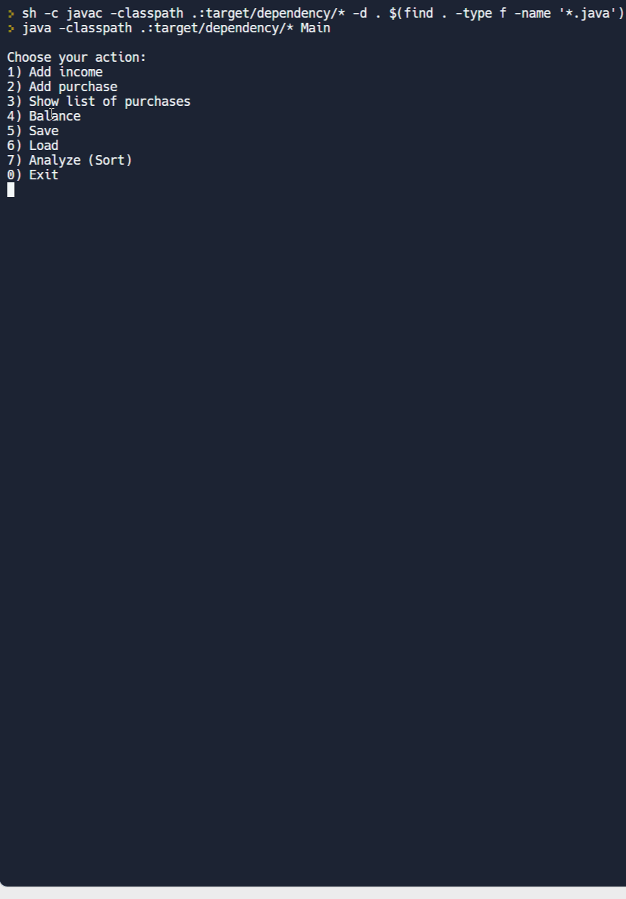

# BudgetManager

## Video Walkthrough

Here's a walkthrough of the program output:



## Program Description 

This program displays a Budget Manager menu that consists of a Main Menu of items and functions. Then it assigns a purchase to a specific category from the menu. It also has functions that shows the list of purchases and the balance. 

What's the point of counting the money if the results are lost and forgotten once you close the program? To allow for some long-term budget planning, we can also Save purchases to a file *"purchases.txt"*. And we can also Load data from our file to the menu.

**Main Menu**
  1. **Add income** - We must track both our expenses and our income. When this item is selected, the program asks to enter the amount of income.
  2. **Add Purchase** - This item adds a purchase to the list.
  3. **Show the list of purchases** - This menu item displays a list of all expenses and incomes in the order they were made.
  4. **Balance** - Shows the balance.
  5. **Save** - Saves all purchases to the file.
  6. **Load** - Loads/Reads all purchases from the file.
  7. **Analyse (Sort)** - opens a list of 3 ways to sort (sort all purchases, sort by type, sort certain type)
  0. **Exit** - Exits the program. For convenience and ease of readability, this is item **0**, not item 7.    


**Purchase Menu**
 1. **Food** - Enter and Add food purchase name and purchase price here
 2. **Clothes** - Enter and Add clothes purchase name and purchase price here
 3. **Entertainment** - Enter and Add entertainment purchase name and purchase price here
 4. **Other** - Enter and Add other purchase name and purchase price here 
 5. **Back** - Go back to the Main Menu 

**Show list of purchases menu**
 1. **Food** - Display food purchase name and purchase price 
 2. **Clothes** - Display clothes purchase name and purchase price 
 3. **Entertainment** - Display entertainment purchase name and purchase price 
 4. **Other** - Display other purchase name and purchase price  
 5. **All** - Display all purchases 
 6. **Back** - Go back to the Main Menu

**Sort menu (This program allows you to Analyze/Sort purchases in 3 ways)**
  1. **Sort All** - sort the entire shopping list and display it so that the most expensive purchases are at the top of the list.
  2. **Sort By Type** - show which category eats the most money. If a category has no purchases in it the total sum should be $0.
  3. **Sort Certain Type** - same as Sort All, but for a specific category.


## Example
Notice the greater-than symbol followed by a space (> ) is not a part of user input, it just represents the user input after that sign and space. 


**Example 1:**
```
Choose your action:
1) Add income
2) Add purchase
3) Show list of purchases
4) Balance
5) Save
6) Load
7) Analyze (Sort)
0) Exit
> 1

Enter income:
> 1000
Income was added!

Choose your action:
1) Add income
2) Add purchase
3) Show list of purchases
4) Balance
5) Save
6) Load
7) Analyze (Sort)
0) Exit
> 2

Choose the type of purchase
1) Food
2) Clothes
3) Entertainment
4) Other
5) Back
> 1

Enter purchase name:
> Almond 250g
Enter its price:
> 35.43
Purchase was added!

Choose the type of purchase
1) Food
2) Clothes
3) Entertainment
4) Other
5) Back
> 5

Choose your action:
1) Add income
2) Add purchase
3) Show list of purchases
4) Balance
5) Save
6) Load
7) Analyze (Sort)
0) Exit
> 5

Purchases were saved!

Choose your action:
1) Add income
2) Add purchase
3) Show list of purchases
4) Balance
5) Save
6) Load
7) Analyze (Sort)
0) Exit
> 0

Bye!
```


**Example 2:**
```
Choose your action:
1) Add income
2) Add purchase
3) Show list of purchases
4) Balance
5) Save
6) Load
7) Analyze (Sort)
0) Exit
> 6

Purchases were loaded!

Choose your action:
1) Add income
2) Add purchase
3) Show list of purchases
4) Balance
5) Save
6) Load
7) Analyze (Sort)
0) Exit
> 3

Choose the type of purchases
1) Food
2) Clothes
3) Entertainment
4) Other
5) All
6) Back
> 1

Food:
Almond 250g $35.43
Total sum: $35.43

Choose the type of purchases
1) Food
2) Clothes
3) Entertainment
4) Other
5) All
6) Back
> 5

All:
Almond 250g $35.43
Total sum: $35.43

Choose the type of purchases
1) Food
2) Clothes
3) Entertainment
4) Other
5) All
6) Back
> 6

Choose your action:
1) Add income
2) Add purchase
3) Show list of purchases
4) Balance
5) Save
6) Load
7) Analyze (Sort)
0) Exit
> 4

Balance: $964.57

Choose your action:
1) Add income
2) Add purchase
3) Show list of purchases
4) Balance
5) Save
6) Load
7) Analyze (Sort)
0) Exit
> 0

Bye!
```

**Example 3:**
```
Choose your action:
1) Add income
2) Add purchase
3) Show list of purchases
4) Balance
5) Save
6) Load
7) Analyze (Sort)
0) Exit
> 7

How do you want to sort?
1) Sort all purchases
2) Sort by type
3) Sort certain type
4) Back
>1

The purchase list is empty!

How do you want to sort?
1) Sort all purchases
2) Sort by type
3) Sort certain type
4) Back
> 2

Types:
Food - $0
Entertainment - $0
Clothes - $0
Other - $0
Total sum: $0

How do you want to sort?
1) Sort all purchases
2) Sort by type
3) Sort certain type
4) Back
> 3

Choose the type of purchase
1) Food
2) Clothes
3) Entertainment
4) Other
> 2

The purchase list is empty!

How do you want to sort?
1) Sort all purchases
2) Sort by type
3) Sort certain type
4) Back
> 4

Choose your action:
1) Add income
2) Add purchase
3) Show list of purchases
4) Balance
5) Save
6) Load
7) Analyze (Sort)
0) Exit
> 6

Purchases were loaded!

Choose your action:
1) Add income
2) Add purchase
3) Show list of purchases
4) Balance
5) Save
6) Load
7) Analyze (Sort)
0) Exit
> 7

How do you want to sort?
1) Sort all purchases
2) Sort by type
3) Sort certain type
4) Back
> 1

All:
Almond 250g $35.43
Skate rental $30.00
FIJI Natural Artesian Water $25.98
Wrangler Men's Stretch Cargo Pant $19.97
Sensodyne Pronamel Toothpaste $19.74
Men's Dual Defense Crew Socks 12 Pairs $13.00
LEGO DUPLO Town Farm Animals $10.10
Chick-fil-A $10 Gift Card $10.00
Cinema $8.73
Gildan LT $8.61
Hershey's milk chocolate bars $8.54
Keystone Ground Beef $6.28
Red Fuji Apple $5.99
Eggs $3.99
Milk $3.50
Debt $3.50
Great Value Broccoli Florets $1.00
Total: $214.36

How do you want to sort?
1) Sort all purchases
2) Sort by type
3) Sort certain type
4) Back
> 2

Types:
Food - $90.71
Entertainment - $48.83
Clothes - $41.58
Other - $33.24
Total sum: $214.36

How do you want to sort?
1) Sort all purchases
2) Sort by type
3) Sort certain type
4) Back
> 3

Choose the type of purchase
1) Food
2) Clothes
3) Entertainment
4) Other
> 1
 
Food:
Almond 250g $35.43
FIJI Natural Artesian Water $25.98
Hershey's milk chocolate bars $8.54
Keystone Ground Bee $6.28
Red Fuji Apple $5.99
Eggs $3.99
Milk $3.50
Great Value Broccoli Florets $1.00
Total sum: $90.71

How do you want to sort?
1) Sort all purchases
2) Sort by type
3) Sort certain type
4) Back
> 4

Choose your action:
1) Add income
2) Add purchase
3) Show list of purchases
4) Balance
5) Save
6) Load
7) Analyze (Sort)
0) Exit
> 0

Bye!

```
